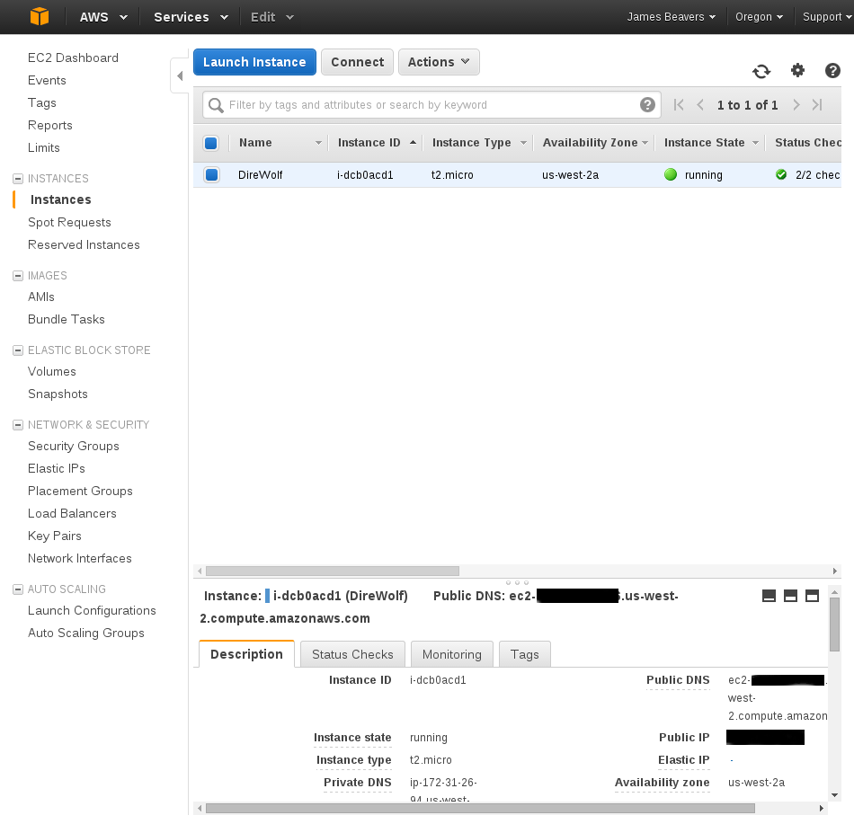
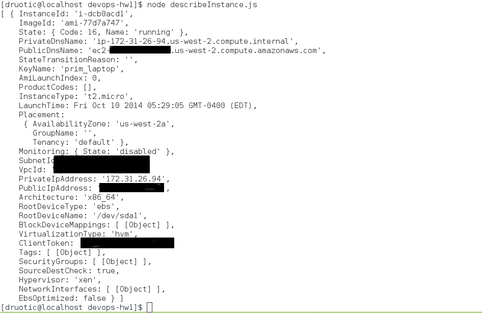

Homework 1 (CSC591 - DevOps)
-------------------

####Description of an AWS service - Amazon EC2

Amazon Elastic Compute Cloud (EC2) is probably one of AWS's most well known services.  In just minutes,
virtual machines can be configured, booted up, and running.  The user picks the type of image, 
resources, and sets up network, security groups, tenancy, etc details.  The user is charged only for
the resources consumed (so much per hour per resource type - varies per machine/resource configuration).
From simple side projects to medium-sized business applications, it can be very convenient to get up 
and running without worrying with the hassles of managing hardware (and cheaper due to scaling if there
are long periods of low resource consumption).

####Description of tasks completed:

- **Authenticate to AWS**  
This was handled by the aws-sdk node module.  Credentials were placed in a file (~/.aws/credentials) and
this module read them when required.  Authentication was required when accomplishing the task below, see reference doc if in doubt (you can't request instance info of an instance you don't own! Well...you can, but you'll get a 401 unauthorized response).

- **Demonstrate a simple API call**  
I already had an existing instance running on EC2, so I chose to make a call which would describe the
running instance.  This was accomplished with a call to aws-sdk's `describeInstances` function. This 
describes details about instances such as public/private IP, public/private DNS name, image ID, etc.
As you can see in the provided screenshot, the instance described by the API call (bottom) matches the instance in the EC2 web view (top).

For reference:  
- API Reference [doc](http://docs.aws.amazon.com/AWSEC2/latest/APIReference/API_DescribeInstances.html)  
- SDK Reference [doc](http://docs.aws.amazon.com/AWSJavaScriptSDK/latest/AWS/EC2.html#describeInstances-property)
